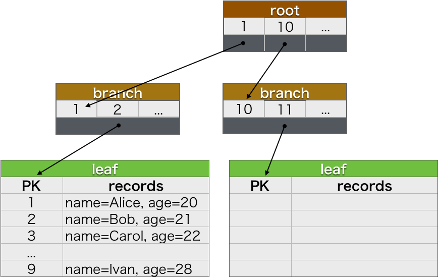
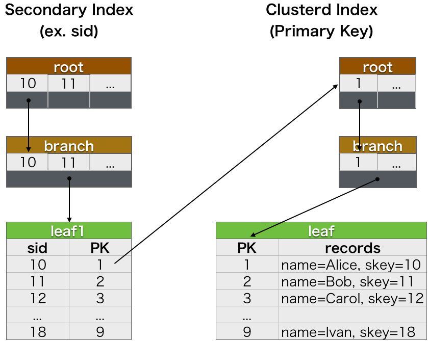
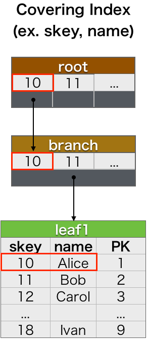

# MySQL

## InnoDB のインデックス

InnoDB のインデックスは B+Tree と呼ばれるデータ構造です。B+Tree は B-Tree と違い、ブランチはリーフノードへのポインタを持ち、データへのポインタはリーフノードのみが持っています。  
InnoDB のインデックスには、クラスタインデックスとセカンダリインデックスがあります。

### クラスタインデックス(Clustered Index)

リーフノードに主キーと行データを格納するインデックスです。そのため、主キーを参照すると同時に行データも取得できるため非常に高速です。  
以下のような構造のテーブルがあったとします。

```
mysql> CREATE TABLE user (id INT AUTO_INCREMENT PRIMARY KEY, name VARCHAR(255) NOT NULL, age INT NOT NULL);
Query OK, 0 rows affected (0.14 sec)

mysql> DESC user;
+-------+--------------+------+-----+---------+----------------+
| Field | Type         | Null | Key | Default | Extra          |
+-------+--------------+------+-----+---------+----------------+
| id    | int(11)      | NO   | PRI | NULL    | auto_increment |
| name  | varchar(255) | NO   |     | NULL    |                |
| age   | int(11)      | NO   |     | NULL    |                |
+-------+--------------+------+-----+---------+----------------+
3 rows in set (0.02 sec)
```

主キーの `id` を参照すると、`name`, `age` のデータも同時に取得できます。

クラスタインデックスの構造を図にすると以下のようなイメージです。



### セカンダリインデックス(Secondary Index)

InnoDB では、クラスタインデックス以外のインデックスはすべてセカンダリインデックスです。セカンダリインデックスは、リーフノードにセカンダリインデックスの値とクラスタインデックスのキー(主キー)を格納しています。  
以下のような構造のテーブルがあったとします。

```
mysql> CREATE TABLE user (id INT AUTO_INCREMENT PRIMARY KEY, name VARCHAR(255) NOT NULL, skey INT, INDEX (skey));
Query OK, 0 rows affected (0.04 sec)

mysql> DESC user;
+-------+--------------+------+-----+---------+----------------+
| Field | Type         | Null | Key | Default | Extra          |
+-------+--------------+------+-----+---------+----------------+
| id    | int(11)      | NO   | PRI | NULL    | auto_increment |
| name  | varchar(255) | NO   |     | NULL    |                |
| skey  | int(11)      | YES  | MUL | NULL    |                |
+-------+--------------+------+-----+---------+----------------+
3 rows in set (0.01 sec)

mysql> SHOW INDEXES FROM user;
+-------+------------+----------+--------------+-------------+-----------+-------------+----------+--------+------+------------+---------+---------------+
| Table | Non_unique | Key_name | Seq_in_index | Column_name | Collation | Cardinality | Sub_part | Packed | Null | Index_type | Comment | Index_comment |
+-------+------------+----------+--------------+-------------+-----------+-------------+----------+--------+------+------------+---------+---------------+
| user  |          0 | PRIMARY  |            1 | id          | A         |           0 |     NULL | NULL   |      | BTREE      |         |               |
| user  |          1 | skey     |            1 | skey        | A         |           0 |     NULL | NULL   | YES  | BTREE      |         |               |
+-------+------------+----------+--------------+-------------+-----------+-------------+----------+--------+------+------------+---------+---------------+
2 rows in set (0.00 sec)
```

セカンダリインデックスの構造を図にすると以下のようなイメージです。



セカンダリインデックス `skey` を参照すると主キーである `id` を特定できます。主キーが特定できたらクラスタインデックスを参照して行データを取得します。このようにセカンダリインデックスでは、主キーの特定と行データの取得の2回インデックスを探索する必要があります。そのため、クラスタインデックスと比較すると低速です。

### カバリングインデックス(Covering Index)

カバリングインデックスは、WHERE 句の条件と参照するカラムがセカンダリインデックスに含まれているカラムのみだった場合に利用されます。以下のような構造のテーブルがあったとします。

```
mysql> CREATE TABLE user (id INT AUTO_INCREMENT PRIMARY KEY, name VARCHAR(255) NOT NULL, skey INT, INDEX skey_name(skey, name));
Query OK, 0 rows affected (0.06 sec)

mysql> DESC user;
+-------+--------------+------+-----+---------+----------------+
| Field | Type         | Null | Key | Default | Extra          |
+-------+--------------+------+-----+---------+----------------+
| id    | int(11)      | NO   | PRI | NULL    | auto_increment |
| name  | varchar(255) | NO   |     | NULL    |                |
| skey  | int(11)      | YES  | MUL | NULL    |                |
+-------+--------------+------+-----+---------+----------------+
3 rows in set (0.02 sec)

mysql> SHOW INDEXES FROM user;
+-------+------------+-----------+--------------+-------------+-----------+-------------+----------+--------+------+------------+---------+---------------+
| Table | Non_unique | Key_name  | Seq_in_index | Column_name | Collation | Cardinality | Sub_part | Packed | Null | Index_type | Comment | Index_comment |
+-------+------------+-----------+--------------+-------------+-----------+-------------+----------+--------+------+------------+---------+---------------+
| user  |          0 | PRIMARY   |            1 | id          | A         |           0 |     NULL | NULL   |      | BTREE      |         |               |
| user  |          1 | skey_name |            1 | skey        | A         |           0 |     NULL | NULL   | YES  | BTREE      |         |               |
| user  |          1 | skey_name |            2 | name        | A         |           0 |     NULL | NULL   |      | BTREE      |         |               |
+-------+------------+-----------+--------------+-------------+-----------+-------------+----------+--------+------+------------+---------+---------------+
3 rows in set (0.00 sec)
```

セカンダリインデックスを `skey_name(skey, name)` のように作成すると、リーフノードには `skey` と `name`, `PK(主キー)` が格納されます。このとき、

```
SELECT name FROM user WHERE skey = 10;
```

を実行すると、`skey` でセカンダリインデックスを検索し、リーフノードに格納されているデータに辿り着きます。通常のセカンダリインデックスの動作であれば、ここで特定した主キーからクラスタインデックスを検索してデータを取得しますが、SELECT 文で指定しているカラムは `name` だけなので、すでに必要なデータは取得できています。そのため、セカンダリインデックスを使った参照でありながら高速に動作します。  

カバリングインデックスの動作を図にすると以下のようなイメージです。



## インデックスの動作例

以下のコマンドを実行してデータベース、テーブルを作成し、データを追加します(100万行あります)。

```shell
mysql -u root -e "CREATE DATABASE testdb"
mysql -u root testdb -e "CREATE TABLE t1 (id INT AUTO_INCREMENT PRIMARY KEY, c1 INT, c2 INT, c3 INT)"
for i in $(seq 0 999); do { echo "INSERT INTO t1 (c1, c2, c3) VALUES "; for j in $(seq 1 1000); do ii=$(( ($i * 1000) + $j )); iii=$(( $ii + 10000000)); iiii=$(( $ii + 100000000)); echo -n " (${ii}, ${iii}, ${iiii}),"; done ; } | sed -e "s/,$//" | mysql -u root testdb; done
```

### インデックスを使わない参照

インデックスを使わない場合、テーブルをフルスキャンします。

```
mysql> SELECT * FROM t1 WHERE c1 = 500000;
+--------+--------+----------+
| id     | c1     | c2       |
+--------+--------+----------+
| 500000 | 500000 | 10500000 |
+--------+--------+----------+
1 row in set (0.17 sec)

mysql> EXPLAIN SELECT * FROM t1 WHERE c1 = 500000;
+----+-------------+-------+------+---------------+------+---------+------+--------+-------------+
| id | select_type | table | type | possible_keys | key  | key_len | ref  | rows   | Extra       |
+----+-------------+-------+------+---------------+------+---------+------+--------+-------------+
|  1 | SIMPLE      | t1    | ALL  | NULL          | NULL | NULL    | NULL | 998222 | Using where |
+----+-------------+-------+------+---------------+------+---------+------+--------+-------------+
1 row in set (0.00 sec)
```

`EXPLAIN` の `rows` 列は検索する行数の推定値です。ほぼすべての行を検索しているため時間がかかっています。

### 主キーを使った参照

主キーは重複しないため、`id = 500000` とした場合、1行検索するだけでデータを取得できます。

```
mysql> SELECT * FROM t1 WHERE id = 500000;
+--------+--------+----------+-----------+
| id     | c1     | c2       | c3        |
+--------+--------+----------+-----------+
| 500000 | 500000 | 10500000 | 100500000 |
+--------+--------+----------+-----------+
1 row in set (0.00 sec)

mysql> EXPLAIN SELECT * FROM t1 WHERE id = 500000;
+----+-------------+-------+-------+---------------+---------+---------+-------+------+-------+
| id | select_type | table | type  | possible_keys | key     | key_len | ref   | rows | Extra |
+----+-------------+-------+-------+---------------+---------+---------+-------+------+-------+
|  1 | SIMPLE      | t1    | const | PRIMARY       | PRIMARY | 4       | const |    1 | NULL  |
+----+-------------+-------+-------+---------------+---------+---------+-------+------+-------+
1 row in set (0.00 sec)
```

### セカンダリインデックスを使った参照

セカンダリインデックスを使って検索するために、まずセカンダリインデックスを作成します。

```shell
mysql -u root testdb -e "ALTER TABLE t1 ADD INDEX c1(c1)"
```

```
mysql> SELECT * FROM t1 WHERE c1 = 500000;
+--------+--------+----------+-----------+
| id     | c1     | c2       | c3        |
+--------+--------+----------+-----------+
| 500000 | 500000 | 10500000 | 100500000 |
+--------+--------+----------+-----------+
1 row in set (0.00 sec)

mysql> EXPLAIN SELECT * FROM t1 WHERE c1 = 500000;
+----+-------------+-------+------+---------------+------+---------+-------+------+-------+
| id | select_type | table | type | possible_keys | key  | key_len | ref   | rows | Extra |
+----+-------------+-------+------+---------------+------+---------+-------+------+-------+
|  1 | SIMPLE      | t1    | ref  | c1            | c1   | 5       | const |    1 | NULL  |
+----+-------------+-------+------+---------------+------+---------+-------+------+-------+
1 row in set (0.00 sec)
```

インデックス `c1` を使っているため、1行の検索でデータを取得していることがわかります。

### 複合インデックスを使った参照

複合インデックスを使った検索を行うために、先程のインデックス `c1` を削除し、`c1_c2` インデックスを作成します。

```shell
mysql -u root testdb -e "ALTER TABLE t1 DROP INDEX c1"
mysql -u root testdb -e "ALTER TABLE t1 ADD INDEX c1_c2(c1, c2)"
```

```
mysql> SELECT * FROM t1 WHERE c1 = 500000 AND c2 = 10500000;
+--------+--------+----------+-----------+
| id     | c1     | c2       | c3        |
+--------+--------+----------+-----------+
| 500000 | 500000 | 10500000 | 100500000 |
+--------+--------+----------+-----------+
1 row in set (0.00 sec)

mysql> EXPLAIN SELECT * FROM t1 WHERE c1 = 500000 AND c2 = 10500000;
+----+-------------+-------+------+---------------+-------+---------+-------------+------+-------+
| id | select_type | table | type | possible_keys | key   | key_len | ref         | rows | Extra |
+----+-------------+-------+------+---------------+-------+---------+-------------+------+-------+
|  1 | SIMPLE      | t1    | ref  | c1_c2         | c1_c2 | 10      | const,const |    1 | NULL  |
+----+-------------+-------+------+---------------+-------+---------+-------------+------+-------+
1 row in set (0.00 sec)
```

インデックス `c1_c2` を使って1行の検索でデータを取得していることがわかります。

複合インデックスはカラムを指定する順番に意味があります。`c1, c2` と指定した場合は `c1` だけを WHERE 句の条件にした場合もインデックスを使うことができますが、`c2` だけを WHERE 句の条件にした場合はインデックスが使われません。以下が実行例です。

```
mysql> SELECT * FROM t1 WHERE c1 = 500000;
+--------+--------+----------+-----------+
| id     | c1     | c2       | c3        |
+--------+--------+----------+-----------+
| 500000 | 500000 | 10500000 | 100500000 |
+--------+--------+----------+-----------+
1 row in set (0.00 sec)

mysql> EXPLAIN SELECT * FROM t1 WHERE c1 = 500000;
+----+-------------+-------+------+---------------+-------+---------+-------+------+-------+
| id | select_type | table | type | possible_keys | key   | key_len | ref   | rows | Extra |
+----+-------------+-------+------+---------------+-------+---------+-------+------+-------+
|  1 | SIMPLE      | t1    | ref  | c1_c2         | c1_c2 | 5       | const |    1 | NULL  |
+----+-------------+-------+------+---------------+-------+---------+-------+------+-------+
1 row in set (0.00 sec)

mysql> SELECT * FROM t1 WHERE c2 = 10500000;
+--------+--------+----------+-----------+
| id     | c1     | c2       | c3        |
+--------+--------+----------+-----------+
| 500000 | 500000 | 10500000 | 100500000 |
+--------+--------+----------+-----------+
1 row in set (0.68 sec)

mysql> EXPLAIN SELECT * FROM t1 WHERE c2 = 10500000;
+----+-------------+-------+------+---------------+------+---------+------+--------+-------------+
| id | select_type | table | type | possible_keys | key  | key_len | ref  | rows   | Extra       |
+----+-------------+-------+------+---------------+------+---------+------+--------+-------------+
|  1 | SIMPLE      | t1    | ALL  | NULL          | NULL | NULL    | NULL | 997899 | Using where |
+----+-------------+-------+------+---------------+------+---------+------+--------+-------------+
1 row in set (0.01 sec)
```

インデックスに指定するカラムが 3 つになった場合は、`c1`, `c1, c2`, `c1, c3`, `c1, c2, c3` を条件とした場合はインデックスが使われますが、それ以外の `c2`, `c2, c3`, `c3` を条件にした場合はインデックスが使われません。

### カバリングインデックスを使った参照

カバリングインデックスを使った検索を行うために、先程の複合インデックス `c1_c2_c3` を削除し、`c1_c2_c3` インデックスを作成します。

```shell
mysql -u root testdb -e "ALTER TABLE t1 DROP INDEX c1_c2"
mysql -u root testdb -e "ALTER TABLE t1 ADD INDEX c1_c2_c3(c1, c2, c3)"
```

前述の通り、カバリングインデックスはセカンダリインデックスのリーフノードにすべてのデータが格納されている場合に使われます。そのため、SELECT 文のカラムを明示的に指定する必要があります(以下の例では、`c1` を指定してもカバリングインデックスになります)。

```
mysql> SELECT c2, c3 FROM t1 WHERE c1 = 500000;
+----------+-----------+
| c2       | c3        |
+----------+-----------+
| 10500000 | 100500000 |
+----------+-----------+
1 row in set (0.00 sec)

mysql> EXPLAIN SELECT c2, c3 FROM t1 WHERE c1 = 500000;
+----+-------------+-------+------+---------------+----------+---------+-------+------+-------------+
| id | select_type | table | type | possible_keys | key      | key_len | ref   | rows | Extra       |
+----+-------------+-------+------+---------------+----------+---------+-------+------+-------------+
|  1 | SIMPLE      | t1    | ref  | c1_c2_c3      | c1_c2_c3 | 5       | const |    1 | Using index |
+----+-------------+-------+------+---------------+----------+---------+-------+------+-------------+
1 row in set (0.00 sec)
```

EXPLAIN の実行結果 の Extra が `Using index` となっていますね。これは、セカンダリインデックスのみを参照することですべてのデータを取得できていることを示しています。
インデックスが `c1_c2(c1, c2)` だった場合、c3 の値を取得するにはインデックスを参照して主キーを特定し、その主キーでデータを検索して c3 カラムの値を取得する、という動作になるためカバリングインデックスは使われません。
